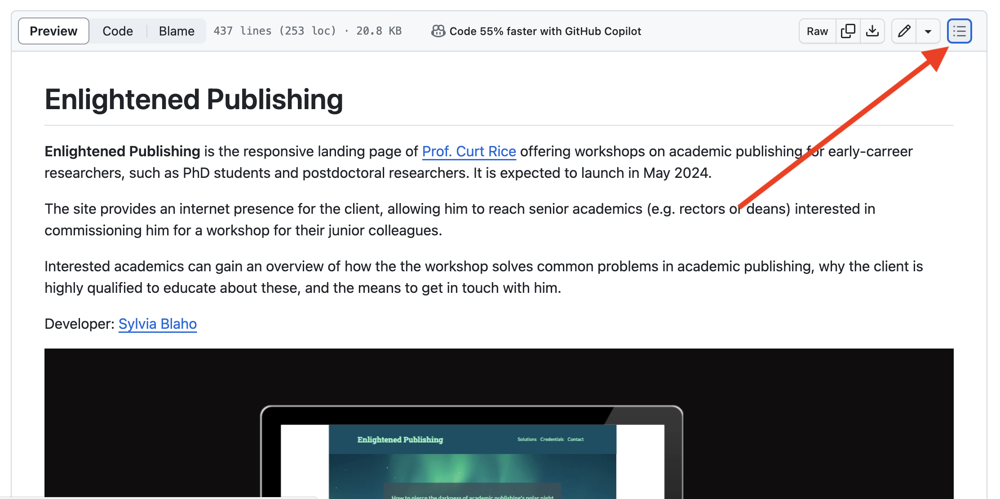

# Enlightened Publishing

**Enlightened Publishing** is the responsive landing page of [Prof. Curt Rice](https://www.linkedin.com/in/curtrice/) offering workshops on academic publishing for early-carreer researchers, such as PhD students and postdoctoral researchers. It is expected to launch in May 2024.

The site provides an internet presence for the client, allowing him to reach senior academics (e.g. rectors or deans) interested in commissioning him for a workshop for their junior colleagues.

Interested academics can gain an overview of how the the workshop solves common problems in academic publishing, why the client is highly qualified to educate about these, and the means to get in touch with him.

Developer: [Dr. Sylvia Blaho](https://www.linkedin.com/in/blahosylvia/)

[View the deployed page on Github Pages](https://blahosyl.github.io/academic-publishing/)

## Contents

	

	You can navigate the document structure by clicking the list icon in the top right corner.
	

## User Experience (UX)

### Background information

The client is an accomplished academic researcher and university leader, who wants to branch out to high-level training and consulting. The project to be launched with this website is a workshop for early-career academics on how to navigate the complexities of academic publishing.

Publishing metrics are paramount for a researcher's career trajectory, but there is very little accessible information on rules and best practices. This is the knowledge gap that the current project aims to fill.

>[!IMPORTANT]
> Even though the **workshop** itself is tailored to junior academics, the target audience of the **website** is their senior peers: institution or faculty leaders such as **rectors, vice-rectors or deans**.

This cohort typically belongs to a higher age group (40-70 years old), and makes browsing and purchasing decisions along the lines of [B2B patterns](https://blog.hubspot.com/agency/differences-b2c-b2b-marketing). In addition, individuals in these positions tend to have extremely busy schedules and a lot of demands on their time and attention.

This has implications on the [features](#features) and [design]
(#design) of the website, as detailed in the respective sections below.

Project goal and scope development thoughout the project (click for details)

##### Initial stage

At the start of the project in February 2024, the client had the following goals:

- create an online presence specifically for this workshop
- add subscribers to his email list
- have universities commission him for the workshop
- direct users to Substack
- have users download the client's ebook on Academic Publishing
- direct users to the client's blog on Gender Bias

The importance/feasibility matrix was determined as follows:

 **Initial Importance/Feasibility matrix** (5: most, 1: least, ~~not included in release~~)
 
|Goal							|Importance	| Feasibility |
|:--- 									|:---: |:---:|
|add subscribers to email list	|5		|5 |
|have customers reach out by email|5		|4 |
|get commissioned					|5		|5 |
|direct users to Substack			|5		|5 |
|have users download ebook			|2		|5 |
|~~direct users to Gender blog~~	|3		|3 |

##### Current stage

Some deliverables have not been completed by the "firends & family" release date of the 1st version of the website (14th of March 2024):

- Custmer Management System (handling email lists)
- Substack account
- 1st draft of the ebook on Publishing
- blog on Gender Bias

Accordingly, the list of goals was modified as follows (~~not included in release~~, *new goal*):

- create an online presence specifically for this workshop
- ~~add subscribers to his email list~~
- *have potential customers contact the client by email*
- *have potential customers book a meeing with the client*
- have universities commission him for the workshop
- ~~direct users to Substack~~
- *direct users to the client's blog on Open Access Publishing*
- *direct users to the client's social media accounts (Twitter/X, LinkedIn)*
- ~~have users download the client's ebook on Academic Publishing~~
- ~~direct users to the client's blog on Gender Bias~~

The importance/feasibility matrix was determined as follows:

 **Updated Importance/Feasibility matrix** (5: most, 1: least, ~~not included in release~~, *new goal*)

|Goal							|Importance	| Feasibility |
|:--- 									|:---: |:---:|
|create an online presence			|5		|5 |
|~~add subscribers to email list~~|4		|1 |
|*have potential customers email*	|5		|4 |
|*have users book meetings*		|5		|5 |
|get commissioned					|5		|5 |
|~~direct users to Substack~~		|5		|1 |
|*direct users to Publishing blog*|3		|5 |
|*direct users to social media*	|3		|5 |
|~~have users download ebook~~	|2		|1 |
|direct users to Gender blog		|3		|1 |

### User stories

#### Client goals

In addition to the business goals detailed under **Project goal and scope development thoughout the project** in the [Background](#background) section, client goals also include aspects of accessibilty and marketing goals. The complete list is as follows:

- [CL1] I want to create an online presence specifically for this workshop. 
- [CL2] I want to offer potential customers an easy-to navigate layout. 
- [CL3] I want to visually appeal to the target audience, conferring approachability and competence.
- [CL4] I want potential customers to contact the me by email.
- [CL5] I want potential customers to book a meeing with me.
- [CL6] I want customers to commission me for holding this workshop.
- [CL7] I want to direct users to the my blog on Open Access Publishing.
- [CL8] I want to direct users to the my social media accounts (Twitter/X, LinkedIn).
- [CL9] I want to reach potential clients outside my professional network.

#### Visitor goals

- [VI1] I want my junior colleagues to receive support in navigating academic publishing.
- [VI2] I want to view the site on various-sized devices.
- [VI3] I want to easily navigate between the different parts of the site.

##### First-time visitor goals

- [FI1] I want to quickly get an overview of the website's purpose.
- [FI2] I want to get informed about the problem the workshop is offering to solve.
- [FI3] I want to know how the workshop proposes to solve the problem.
- [FI4] I want to get an overview of the client's relevant experience in the field of academic publishing.
- [FI5] I want request more information about the workshop.

##### Returning visitor goals

- [RE1] I want to ascertain that the client's experience makes him an expert on the topic.
- [RE2] I want to read the client's blog on Publishing.
- [RE3] I want to book a meeting with the client.
- [RE4] I want request more information about the workshop.
 

##### Frequent visitor goals

- [FR1] I want to book a meeting with the client.
- [FR2] I want to find the client's social media information

## Design

As detailed in the [UX section](#user-experience), the target audience for this website is typically a more senior and B2B-minded cohort, with busy workloads and packed schedules.
Consequently, the design skewes towards minimalism, being clear-cut and avoiding unnecessary visual clutter, such as excessive borders and shadows, elements of very different shapes, background images behind normal text, and auto-moving elements of all kinds. 

This aligns perfectly with accessibility considerations, as detailed in the [Accessibility](#accessibility) section.

It also plays on asssociations with Norway (where the client is based) and Scandinavia in general: minimalism, clean design, straightforwardness and efficiency.

### Color scheme

The color scheme is inspired by the client's background in Norway, most notably, in the arctic town of [Tromsø](https://www.visitnorway.com/places-to-go/northern-norway/tromso/), which experiences a 2-month-long polar night without the sun rising, and spectacular displays of [northern lights](https://arcticexplorers.no/northern-lights).

The dark night and bright lights also serve as a metaphor for the workshop shining a guiding light into the darkness of complicated rules and procedures in academic publishing.

The metaphor is reflected in the site's title: **Enlightened Publishing**.

The site's color arrangement was inspired by [https://inclusiveleadership.solutions/](https://inclusiveleadership.solutions/) and [https://youpreneur.com/](https://youpreneur.com/), using two salient but contrasting colors, combined with white and gray.

The two salient colors chosen for this site are a dark petrol (#9FFFCB)  and a light mint (#004e64). These colors represent the arctic night sky and northern lights, respectively.

Turning to the supporting colors used, white, evocative of the ubiquitous snow in the arctic, is used in the design. In the spirit of minimalism and to offset the salience of the 2 main colors, simple, pur white (#FFFFFF) is used.

The gray in this color palette has tones of blue-green, reminiscent of ice, and providing a bridge between the two salient colors. 

A 5th color, a darker shade of gray, was introduced during accessibility testing, to make sure that there is sufficient contrast between background and text everywhere (see the [Accessibility testing](#accessibility-testing) section for more detail). 

This resulted in the following color palette.

Color variables were used instead of hard-coding colors for each element, so that the overall color scheme can easily be modified in the future if needed. 
This was based on the [W3Schools tutorial on variables](https://www.w3schools.com/css/css3_variables.asp), a resource pointed out by my mentor. 
This design also enabled me to easily and quickly make adjustments to the color scheme during accessibility testing (see the [Accessibility testing](#accessibility-testing) section for more detail).

### Flow

The client heavily preferred a continuous website rather than separate clickable pages, citing results that show that user engagement drastically decreases after each time a user has to click.
In accordance with this, the website consists of 3, visually separate sections that can be continuously scrolled through:

1. Problems & Solutions section
2. About/Credentials section titled "Why me?"
3. Contact section

While it is customary to put the **About** information first on a site, we decided for an approach that centers the problems the workshop aims to solve and their solutions, as the clients wants to reach clients that might not know him professionally. Therefore, while his name and professional credetials are important information, they were deemed secondary to the goal of the workshop.

To ease navigation, the header remains visible throughout.

### Imagery

#### Hero image

The [hero image](https://www.pexels.com/photo/blue-and-green-sky-and-mountain-3617500/) shows an arctic landsape with mountains, water, and northern lights. It alludes to the client's professional background in Norway. The northern lights evoke a sense of awe and hope (light in the darkness).

#### Problems & Solutions section imagery
 
##### Problems imagery

The **Problems** subsection features grayscale images tinted dark with one of the main colors of the website. 

The [first image](https://raw.githubusercontent.com/blahosyl/academic-publishing/main/assets/images/lots-of-paper-grayscale.webp) shows a huge pile of papers stacked in a haphazard fashion, symbolising the large amout of academic publications on the one hand, and the multitude of journals and publishers on the other hand.

The [second image](https://raw.githubusercontent.com/blahosyl/academic-publishing/main/assets/images/frustrated-grayscale.webp) shows a person in front of a computer in a frustrated pose, illustrating a frequent reaction to the current state of affairs in academic publishing. I chose a picture of a female-read person of color, as these groups are underrepresented in academia (and in general).

##### Solutions imagery

The Solutions subsection features colored images, only slightly tinted with the website's light main color.

The [first image](https://raw.githubusercontent.com/blahosyl/academic-publishing/main/assets/images/library.webp) shows a modern, spacious, brightly lit library, symbolising a more open and more efficient future to come. This picture also illustrates the multitude of information and aptitudes that can be acquired during this workshop.

The [second image](https://raw.githubusercontent.com/blahosyl/academic-publishing/main/assets/images/presentation.webp) shows the client on stage, giving a speech, in a dynamic and engaging pose. This evokes a sense of participating in the workshop given by the client.

#### About/Credentials section imagery

The [**About** section](https://raw.githubusercontent.com/blahosyl/academic-publishing/main/assets/images/why-me-img.webp) shows the client in a confident pose in front of a grafitti wall. It centers the client as both competent and approachable. The image has been re-colored to fit the site's color scheme.

The second and third parts of this section have a lot of interactivity (flip cards and a video), so no images are included here to avoid overwhelm.

#### Contact section imagery

The **Contact** section does not feature any images. This is a conscious choice to adhere to minimalism and simplicity: as this section has the most interactive elements (the Calendly widget and the email contact form), I wanted to minimise user distractions while interacting with these.

### Header design

The header embodies the goals of minimalism in design: only uses the 2 hero colors and no background images. Since the header is "sticky", that is, present at all times regardless of how far down the user scrolls, keeping it as simple as possible was of utmost importance.

For highlighting active links on hover, white is used – again, choosing the simplest possible option to keep the page uncluttered.

### Hero image design

The hero image features the main tagline of the project with the mint salient color on a slightly transparent dark gray background, centered. This ensures the legibility of the tagline at the same time as letting the hero image shine.

### Problems & Solutions section design

#### Colors and images | Problems & Solutions section

This section is distinguished from other parts of the site by a gray background color, which remains consistent throughout the section. 

The two subsections comprising the section are visually distinguished from each other by the coloring of the contentful elements (text+image boxes, as described in [Layout](#layout) below).

The **Problems** subsection features a dark color scheme, grayscale images with a dark tint, and images suggesting overwhelm. This alludes to long dark arctic nights, a parrallel to the seemingly hopeless endevour of navigating the intricacies of academic publishing.

The **Solutions** subsection has a bright colored background and full-color images that are only slightly tinted with the same bright color. These suggest the image of northern lights in the dark night sky, evoking feelings of brightness and hope.

#### Layout | Problems & Solutions section

Each subsection consists of 2 text boxes, each with an accompanying image. The text appears below the image on mobile, and next to it on tablets and larger screens. 

For the side-by-side arrangement, every second image-text pair is reversed, so that the image appears alternately on the left and the right side of the image.

In the **Problems** subsection, the cut-off point between the image and text is at the same place. In the **Solutions** subsection, the text/image width ration is the same in the two boxes. Both arrangements create a similar but subtly different symmetry. 

### About/Credentials section design

This section details the relevant past experience of the client. Since the client is an accomplished scholar and university leader with decades of experience, visual cues and user interaction elements were used to break up the information into digestible chunks to avoid overwhelm.

#### Colors and images | About/Credentials section

Leaning into the visual separation of the different sections of the website, this section features a bright background with the mint salient color (#9FFFCB), and a colorful image (modified to fit the site's color scheme) with the client's name and tagline. 
The text background is slightly transparent, to have a more organic connection with the image.

#### Layout | About/Credentials section

The image of this section is full width, with the text on the image changing position depending on the device size: 
- mobile: full width and on the bottom half of the image
- tablet: full height, on the right hand side of the image, extending to the right end
- laptop/desktop: full height, on the right hand side of the image, with some space on the rightmost end of the image

The image is followed by a short introductory text summarising the client's relevant experience, the different jobs/positions/experiences are presented in a responsive grid (based on the [Love Running Project](https://github.com/Code-Institute-Solutions/love-running-v3/)). By default, only the institution and position title is visible; details are uncovered on tap (mobile, tablet) or hover (laptop/desktop). This keeps information easy to take in at a glance, but interested users can also find out more.

The last item in the section is a YouTube video of the client giving a talk. This gives the opportunity for users to see the client presenting to a larger group.

### Contact section design

#### Colors and images | Contact section

This section features 2 very interactive elements (the Calendly widget and contact form), so it is kept the most minimalistic to avoid overwhelm: it has no images, and features the most plain color palette (also used in the header): dark background and light text.

#### Layout | Contact section

One core principle of B2B marketing is to offer as many possibilities for connecting with the company as possible. In the spirit of this, the website features both a Calendly widget for scheduling meetings with the client, and a contact form for getting in touch by email.

The [footer](#footer) has additional contact links to the client's social media profiles.

The Calendly widget is integrated into the site, and styled in alignment and color. In larger screens, there is an a white margin around the calendar element, which disappears on smaller screens. To keep the widget distinct, I have added a white border to it for smaller screens. Users can view the client's available meeting times and set up a meeting with an automatic [Google Meet](https://meet.google.com/) link using the widget.

The second part of this section contains the contact form, where users can submit their name, email address and workshop preferences to the client. 
For the present implementation, this is set up to result in the Code Institute confirmation screen rather than connected to the client's CRM (Customer Relationship Management) system, so that the Code Insitute assessors can easily evaluate the functionality of the form.
For the public launch (planned for May 2024), this will be changed so that the client will receive these data in his CRM system.

### Footer design

The footer also features a minimalist design (similarly to the header). It consists of two, visually distint parts, the top one containing the social media links, and the bottom one the copyright information.

Both of these parts have a two-tone color scheme and no background images, to maximize efficiency and minimize distractions (again, paralleling the header).

As the footer is intended to be less salient than the header, the footer background colors used are the two shades of gray.

To round out the parallels between the footer and the header, the same color-changing hover effect is used on the links in both elements.

The parallels between the two elements aid in the recognition of functionalities, and reduce cognitive load.

### Typography

[Google Fonts](https://fonts.google.com/) are used in this project. The client chose [Roboto Slab](https://fonts.google.com/specimen/Roboto+Slab?subset=latin&noto.script=Latn) for headings, and [Lato](https://fonts.google.com/specimen/Lato?subset=latin&noto.script=Latn) for normal text. These are professional, approachable, and easy to read.

### Wireframes

## Features

In accordance with the target audience and the user stories (see the [User Experience](#user-experience-(ux)) section), the features are focused on efficient navigation, information transfer and contact options.

### Logo

Since there is no separately designed logo for the project yet, the site features the title of the project in a large font and in the most prominent place, the top left corner. 

The logo responsive, adapting to the viewport size.

The logo also doubles as a navigation element: clicking it takes the visitor back to the top of the page. On devices with pointer capabilities (e.g. mouse or trackpad), the logo changes color when hovered over:

### Nav bar

The nav bar (or navigation bar in long-form) ensures that visitors can quickly and easily navigate between various parts of the site. This is especially important given that the website is a continuous one, rather than being broken up into different `html` files.

The nav bar is responsive to the type of device the site is viewed on: it appears as an expandable "hamburger" icon on smaller devices. 

This functionality is based on the nav bar implementation of the [Love Running Project](https://github.com/Code-Institute-Solutions/love-running-v3/). However, instead of expanding the nav bar and putting the nav elements under the logo, I have chosen to have them appear right under the hamburger icon, so that the user action (tapping the hamburger icon) and the result (the nav elements appearing) is closer together.

On larger screens, the navigation bar shows the links to the 3 main sections of the site side by side. 

On devices with pointer capabilities (e.g. mouse or trackpad), the links in the navigation bar change color when hovered over:

Because the site is a continuous one, rather than consisting of separate `html` files, there is no highlighting of the current section the user is in in the nav bar. To offset this, color schemes are used to indicate different sections (see the [Design](#design) section for more details).

### Header

The header contains the [logo](#logo) and the [nav bar](#nav-bar) (more on these in their respective sections).

Because the header houses the most important site navigation elements, it is always visible, regardless of how far the visitor scrolls down the site (also called "sticky"). This implementation is based on the [Love Running Project](https://github.com/Code-Institute-Solutions/love-running-v3/).

### Hero section

This section features the hero image, defining the feel and color scheme of the website, as well as the main tagline of the project.

### Problems & Solutions section

This section features descriptions of the issues the client is trying to solve, and the means to solve them. The information is displayed in responsive boxes containing a block of text and an image each.

### About/Credentials section

This section provides information to visitors about the client's professional experience in academic publishing.

#### Credentials image and tagline

#### Credential cards

The client's relevant experience is displayed on individual cards to avoid creating a large block of text and break up the information into smaller, digestible pieces.

The cards are arranged in a responsive grid using Flexbox, similarly to the "running times" section of the [Love Running Project](https://github.com/Code-Institute-Solutions/love-running-v3/).

Additionally, the information within each card is divided into 2, and presented as a result of user interaction:

- By default, each cards shows the name of the institution/organisation, the position the client held there. 
- When the user taps or hovers over a card (depending on the type of device used), this information is replaced by a more detailed description of the client's experience. 

In accordance with my mentor's suggestion, I have added explicit text to tap or hover for more information. I have decided to add this text to each card rather than just adding it once above the card block, because I consider it better for accessibility. The tap/hover text is also visually different from the rest of the text on the card, to make the functionality more explicit.

#### Video

The last element of the section is a video of the client giving a recorded talk in front of an audience. This provides a more hands-on proof of his speaker capabilities.

### Contact section

### Footer

The footer contains links to the client's social media accounts (LinkedIn, Twitter/X and his blog), as well as the copyright information for the site. These are visually separated by different background colors for additional ease of navigation.

The navigation links in the footer consist of universally recognisable icons. These change color on hover on devices with pointer capabilities (e.g. mouse or trackpad). This implementation is based on the [Love Running Project](https://github.com/Code-Institute-Solutions/love-running-v3/).

Contrary to other links on the site, the footer links are not underlined, as this would be very unusual for the icons used.

Since the footer links point to external resources, they open in a new tab.

### Future implementations

The features of the website were assigned to planned releases as follows:

|Feature						|March 14	| May |Q4 |
|:--- 							|:---: |:---:|:----:|
|navigation bar				|:+1:	|	| 	|
|social media links			|:+1:	| 	| 	|
|description of problems 	|:+1:	| 	| 	|
|description of workshop 	|:+1:	| 	| 	|
|home page & tagline	 	|:+1:	| 	| 	|
|About information		 	|:+1:	| 	| 	|
|About picture		 		|:+1:	| 	| 	|
|relevant experience 		|:+1:	| 	| 	|
|email contact form		 	|:+1:	| 	| 	|
|meeting scheduler		 	|:+1:	| 	| 	|
|download link for ebook	| 		|:+1:| |
|link to Substack			| 		|:+1:| |
|testimonials (general)		| 		|:+1:| |
|link to Gender blog		| 		|		|:+1:|
|videos (from workshops)	| 		|		|:+1:|
|testimonials (from workshops)| 	|		|:+1:|

### Accessibility

As a consequence of designing for an older and more straightforward-minded demographic (see [Background](#background) in the User Experience section), the site avoids visual clutter, such as excessive borders and shadows, elements of very different shapes, color gradients, background images behind normal text, and auto-moving elements of all kinds. 

These elements tend to cause problems for a variety of users (e.g. those with visual impairment, executive functioning impairment, vertigo, etc.), so steering clear of these chimes in perfectly with accessibility goals.

aria labels, 

alt text, 

colour scheme, 

font choices

External links open in a new tab.

The embedded video does not start auto-playing.

## Technologies used

### Languages used

HTML, CSS

### Frameworks,  Libraries & Programs Used

Atom – code editor

Balsamiq – wireframes

Git – version control

GitHub – store the source files

GitHub Desktop – GitHub UI

[Google Fonts](https://fonts.google.com/) - import fonts used on the website

Google Dev Tools – troubleshoot, test responsivity and styling

FontAwsome – icons

[TinyPNG](https://tinypng.com/) – compress images

[convert images to grayscale](https://www.grayscaleimage.com/)

[Birme](https://www.birme.net/) – resize images and convert to `webp` format

Favicon.io – create the favicon

Am I Responsive? – to show the website image on a range of devices

<!--Shields.io – add badges to README
-->
[Coolors.co](https://coolors.co/) - color palettes, 

[WebAIM](https://webaim.org/resources/contrastchecker/) – color contrast checking

[Lipsum](https://www.lipsum.com/), [loremipsum.io](https://loremipsum.io/) – Lorem Ipsum generators

[Pixelied](https://pixelied.com/convert/jpg-converter/jpg-to-webp) – `jpg` to `webp` converter

## Deployment

### Local deployment

To view the site on your local machine (laptop or desktop), follow these steps:

1. click the following link to download the [zipped project folder from GitHub](https://github.com/blahosyl/academic-publishing/archive/refs/heads/main.zip).
2. double click on the downloaded zip file `academic-publishing-main.zip` to unzip it.
3. in the folder `academic-publishing`, double click on `index.html` to open it in your browser.

>[!IMPORTANT]
> Do not take `index.html` out of the folder, or change the folder structure in any way, as this may break the file paths defined in the project. 

### Fork the repository

You can fork the repository by following these steps:

1. Log in to [GitHub](https://github.com/) (if you don't have a GitHub account yet, you can [create one](https://docs.github.com/en/get-started/start-your-journey/creating-an-account-on-github) for free).
2. Navigate to the project website [https://github.com/blahosyl/academic-publishing](https://github.com/blahosyl/academic-publishing).
3. Click on **Fork** in the upper right part of the screen.
4. On the next page you have the possibility to change the repsitory name. To do this, simply write your desired name in the text field in the center part of the screen. You can also leave the name as it is.
5. Click **Fork** in the bottom right part of the screen.

>[!TIP]
>If you do rename the repository, make sure to keep the [GitHub naming conventions](https://github.com/bcgov/BC-Policy-Framework-For-GitHub/blob/master/BC-Gov-Org-HowTo/Naming-Repos.md) in mind. 

### Deployment on GitHub Pages

The site was deployed on GitHub pages using the steps below. You can follow the same steps to deploy it on your GitHub account after you have forked the repository.

1. Log in to [GitHub](https://github.com/) (if you don't have a GitHub account yet, you can [create one](https://docs.github.com/en/get-started/start-your-journey/creating-an-account-on-github) for free).
2. Navigate to the project website [https://github.com/blahosyl/academic-publishing](https://github.com/blahosyl/academic-publishing).
3. Click on [Settings](https://github.com/blahosyl/academic-publishing/settings) in the top right of the screen.
4. On the left-hand menu, click [Pages](https://github.com/blahosyl/academic-publishing/settings/pages).
5. In the center of the page under **Branch**, select **main** from the dropdown menu, then click **Save**.
6. After the site refreshes automatically, a message appears in the top center part of the screen, displaying the link to the deployed site: "Your site is live at [https://blahosyl.github.io/academic-publishing/](https://blahosyl.github.io/academic-publishing/)". 

>[!NOTE]
>The link will look stlightly different for you, containing your [GitHub username](https://docs.github.com/en/account-and-profile/setting-up-and-managing-your-personal-account-on-github/managing-email-preferences/remembering-your-github-username-or-email) instead of `blahosyl`. 

>[!NOTE]
>If you have renamed the repository when forking it, your chosen repository name will appear instead of `academic-publishing` in the deployment link.

## Testing

### Automated testing
W3C validator
Lighthouse

### Manual testing
Testing user stories
Full testing of functionalities

#### Devices
 iPhone 12 Pro, iOS 17.2.1; iPad Pro, iPadOS 17.3.1; iPhone XR, iOS 17.4;
 
#### Browsers

The site was tested on the following browsers:

- Google Chrome
- Mozilla Firefox
- Safari

####Footer

The links to the client's social media accounts open in a new tab.

### Accessibility testing
Wave
Web Disability Simulator

Contrast between 2 salient colors: 7.75:1 ([WebAIM](https://webaim.org/resources/contrastchecker/))

Light and dark gray: 7.02:1
Dark and white: 9.23:1
Dark gray and white: 4.5:1 (only used for large text)
Gray and light: 3.78:1 (only used for graphical objects)

### Bugs

[Known](https://github.com/blahosyl/academic-publishing/issues) and [solved bugs/enhancements](https://github.com/blahosyl/academic-publishing/issues?q=is%3Aissue+is%3Aclosed) are tracked in [GitHub Issues](https://github.com/blahosyl/academic-publishing/issues).

>[!WARNING]
>Note: because of mistakenly starting issues in the wrong repository and later transferring them to the correct one, issue numbers in the commit messages up to commit nr. [325a625dc5de4d670ef58a9617ec092529db10f1](https://github.com/blahosyl/academic-publishing/commit/325a625dc5de4d670ef58a9617ec092529db10f1) don't match the new issue numbers in the repository. Unfortunately, the numbering of the transferred issues cannot be changed anymore.

However, each issue has the corresponing commits linked, and these links work correctly. In addition, subsequent commit messages after [325a625dc5de4d670ef58a9617ec092529db10f1](https://github.com/blahosyl/academic-publishing/commit/325a625dc5de4d670ef58a9617ec092529db10f1) point to correct issues.

## Credits

### Code

Variables https://www.w3schools.com/css/css3_variables.asp

[Recommended image sizes](https://tiny-img.com/blog/best-image-size-for-website/), [2](https://www.foregroundweb.com/image-size)

[Make the header sticky](https://gomakethings.com/how-to-create-a-sticky-navigation-with-only-css/)

[Pseudoclasses](https://www.w3schools.com/css/css_pseudo_classes.asp) (credential cards)

Media query re. pointing device (mouse/trackpad): [Mozilla](https://developer.mozilla.org/en-US/docs/Web/CSS/@media/pointer)
[CanIUse](https://caniuse.com/css-media-interaction)
[Stackoverflow](https://stackoverflow.com/questions/11387805/media-query-to-detect-if-device-is-touchscreen)
 (credential cards)

[Push 1 paragraph to to bottom of container without affecting the rest](https://stackoverflow.com/a/39613036) (credential cards)

[`filter`](https://www.w3schools.com/cssref/css3_pr_filter.php) (not used in final version)

[hue-rotate](https://developer.mozilla.org/en-US/docs/Web/CSS/filter-function/hue-rotate), [2](https://www.quackit.com/css/functions/css_hue-rotate_function.cfm) (not used in final version)

[calculate filter](https://stackoverflow.com/a/73824920), [2](https://isotropic.co/tool/hex-color-to-css-filter/) (not used in final version)

[`iframe`](https://www.w3schools.com/html/html_youtube.asp)

[Embedding YouTube videos](https://www.lifelearn.com/2019/02/25/youtube-videos-on-your-website/#:~:text=To%20sort%20which%20videos%20you,embed%20functionality%20has%20been%20enabled.)

[Writing on GitHub](https://docs.github.com/en/get-started/writing-on-github/)

[Linking GitHub commits to issues](https://gitdailies.com/articles/link-github-commit-to-issue)

### Content

### Media

#### Images

The books favicon comes from [Favicon.io](https://favicon.io/emoji-favicons/books/), licensed under [CC-BY 4.0](https://creativecommons.org/licenses/by/4.0/)

[FontAwesome](https://fontawesome.com/) icons are used for the hamburger menu in the header navigation bar and the footer social media links.

[Hero image](https://www.pexels.com/photo/blue-and-green-sky-and-mountain-3617500/) by [Benjamin Suter](https://www.pexels.com/@benjaminjsuter/) on [Pexels](https://www.pexels.com/).

[`#millions`](https://raw.githubusercontent.com/blahosyl/academic-publishing/main/assets/images/lots-of-paper-grayscale.webp) image in the Problems & Solutions section by [Christa Dodoo](https://unsplash.com/@krystagrusseck) on [Unsplash](https://unsplash.com/photos/pile-of-papers-MldQeWmF2_g), converted to grayscale using [Grayscale Image]((https://www.grayscaleimage.com/)).

[`#frustrated`](https://raw.githubusercontent.com/blahosyl/academic-publishing/main/assets/images/frustrated-grayscale.webp) image in the Problems & Solutions section by [Mizuno K](https://www.pexels.com/@mizunokozuki/) on [Pexels](https://www.pexels.com/photo/frustrated-businesswoman-sitting-at-an-office-desk-12911178/), converted to grayscale using [Grayscale Image]((https://www.grayscaleimage.com/)).

[`#learn-list`](https://raw.githubusercontent.com/blahosyl/academic-publishing/main/assets/images/library.webp) image in the Problems & Solutions section by [Sara Kurfeß](https://unsplash.com/@stereophototyp) on [Unsplash](https://unsplash.com/photos/people-standing-inside-white-concrete-building-interior-X2R7VLGAPfI).

[`#presentation`](https://raw.githubusercontent.com/blahosyl/academic-publishing/main/assets/images/presentation.webp) image in the Problems & Solutions section by [Benjamin Ward](https://www.benjaminward.no/), provided by the client, modified to reduce optical noise (with permission) by Peter Litauszki.

[Client image](https://raw.githubusercontent.com/blahosyl/academic-publishing/main/assets/images/curtrice-green-2.webp) in the About/Credentials section by [Benjamin Ward](https://www.benjaminward.no/),  provided by the client, colors modified to fit the site's color scheme  (with permission) by Peter Litauszki.

#### Videos

### Readme

- [Creating your first README with Kera Cudmore](https://www.youtube.com/watch?v=XbYJ4VlhSnY) by Code Institute
- [Creating your first README](https://github.com/kera-cudmore/readme-examples) by Kera Cudmore
- [Bully Book Club](https://github.com/kera-cudmore/Bully-Book-Club) by Kera Cudmore
- [Bodelschwingher Hof](https://github.com/4n4ru/CI_MS1_BodelschwingherHof/tree/master) by Ana Runje
- [Travel World](https://github.com/PedroCristo/portfolio_project_1/) by Pedro Cristo
- [Sourdough Bakes](https://github.com/siobhanlgorman) by Siobhan Gorman
- [Horizon Photo](https://github.com/Ri-Dearg/horizon-photo/blob/master/README.md#mobile-testing) by Rory Patrick Sheridan

### Acknowledgements

I would like to thank Curt Rice for agreeing to the tight deadlines of this project, and creating the chance for us to work together again after almost a decade 💪

I am also grateful to my mentor Rory Patrick Sheridan for his excellent advice and relaxed, calming presence, which I certainly appreciated on such a packed schedule 🤓

I also want to thank my cohort facilitator, Kristyna Wach, for smoothing out my learning journey, Adam Kestell and Erick Bandelt for helping with all the questions and administrative issues prior to starting the course, and all Code Institute team members working behind the scenes to ensure a productive learning experience 🎉

Last, but certainly not least, I want to thank Peter Litauszki for his support in a range of technical and non-technical matters, from photo editing to supplying a variety of snacks 🧡
