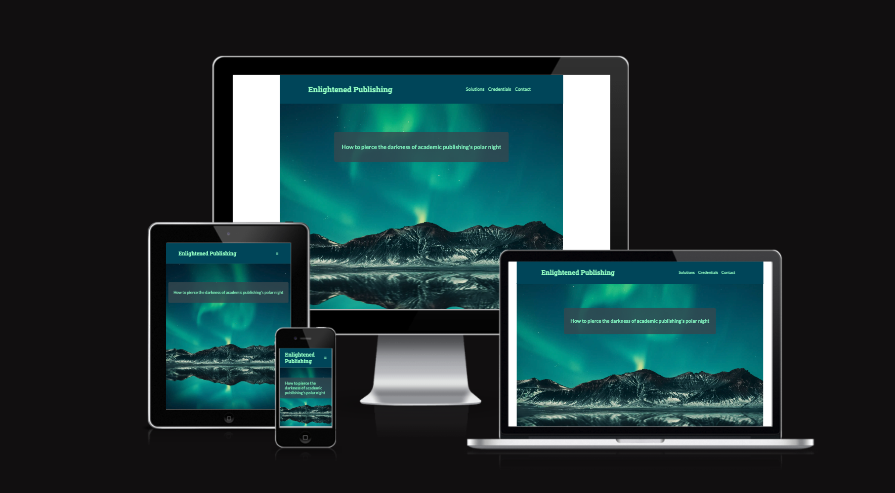

# Enlightened Publishing

**Enlightened Publishing** is the responsive landing page of Prof. Curt Rice offering workshops on academic publishing for early-carreer researchers, such as PhD students and postdoctoral researchers. It is expected to launch in May 2024.

The site provides an internet presence for the client, allowing him to reach potential customers interested in commissioning him for a workshop.

Interested academics can gain an overview of how the the workshop solves common problems in academic publishing, why the client is highly qualified to educate about these, and the means to get in touch with him.

Developer: [Sylvia Blaho](https://www.linkedin.com/in/blahosylvia/)

[View the deployed page on Github Pages](https://blahosyl.github.io/academic-publishing/)

## Contents

## User Experience (UX)

### User stories

#### Client goals

#### First-time visitor goals

#### Returning visitor goals

#### Frequent visitor goals

Find new material

## Design

### Flow

The client heavily preferred a continuous website rather than separate clickable pages, citing results that show that user engagement drastically decreases after each time a user has to click.

In accordance with this, the website consists of 3, visually separate sections that can be continuously scrolled through:

1. Problems & Solutions
2. About/Credentials
3. Contact

To ease navigation, the header remains visible throughout.

### Problems & Solutions section

#### Colors and images

The problems subsection features a dark color scheme, grayscale images with a dark tint, and images suggesting overwhelm.

The Solutions section has a bright colored background and color images that are only slightly tinted with the same bright color.

#### Layout

Each subsection consists of 2 text boxes, each with an accompanying image. The text appears below the image on mobile, and next to it on tablets and larger screens. 

For the side-by-side arrangement, every second image-text pair is reversed, so that the image appears alternately on the left and the right side of the image.

In the Problems section, the cut-off point between the image and text is at the same place. In the Solutions section, the text/image width ration is the same in the two boxes. Both arrangements create a similar but subtly different symmetry. 

### About/Credentials section

This section details the relevant past experience of the client. After a hero image and a short introductory text, the different jobs/positions/experiences are presented in a responsive grid. By default, only the institution and position title (XXX logo?) is visible; details are uncovered on tap (mobile, tablet) or hover (laptop/desktop).

### Contact section

Since the client does not have a CMS/email system set up yet, but wants to offer a way for potential partners to reach out to him before this gets implemented, we decided to integrate [Calendly](https://calendly.com/) into this section, so that people interested in the workshop can set up an online meeting with the client with an automatic [Google Meet](https://meet.google.com/) link.

The Calendly widget is integrated into the site, and styled in alignment and color. In larger screens, there is an a white margin around the calendar element, which disappears on smaller screens. To keep the widget distinct, I have added a white border to it for smaller screens.

### Color scheme

Palette: Arctic, northern lights

Color arrangement inspiration: [https://youpreneur.com/](https://youpreneur.com/)

2 salient colors (#9FFFCB  and #004e64) combined with white, gray (#537D88) and dark gray (#3C5158). 

Contrast between 2 salient colors: 7.75:1 ([WebAIM](https://webaim.org/resources/contrastchecker/))

Light and dark gray: 7.02:1
Dark and white: 9.23:1
Dark gray and white: 4.5:1 (only used for large text)
Gray and light: 3.78:1 (only used for graphical objects)

<!--TODO: decide if we wanna introduce a 3rd salient color, like the green accents on hover-->

Color variables were used instead of hard-coding colors for each element, so that the overall color scheme can easily be modified in the future if needed. This was based on the [W3Schools tutorial on variables](https://www.w3schools.com/css/css3_variables.asp), a resource pointed out by my mentor.

### Imagery

#### Hero image

The [hero image](https://www.pexels.com/photo/blue-and-green-sky-and-mountain-3617500/) shows an arctic landsape with mountains, water, and northern lights. It alludes to the client's professional background in Norway. The northern lights evoke a sense of awe and hope (light in the darkness).

#### Problems & Solutions
 
##### Problems

The Problems subsection features grayscale images tinted dark with one of the main colors of the website. 

The first image shows a huge pile of papers stacked in a haphazard fashion, symbolising the large amout of academic publications on the one hand, and the multitude of journals and publishers on the other hand.

The second image shows a person in front of a computer in a frustrated pose, illustrating an frequent reaction to the current state of affairs in academic publishing. I chose a picture of a female-read person of color, as these groups are underrepresented in academia (and in general).

##### Solutions

The Solutions subsection features colored images, only slightly tinted with the website's light main color.

The first image shows a modern, spacious, brightly lit library, symbolising a more open and more efficient future to come. This picture also illustrates the multitude of information and aptitudes that can be acquired at this workshop.

The second picure shows the client on stage, giving a speech, in a dynamic and engaging pose.

#### About

The [About section](https://raw.githubusercontent.com/blahosyl/academic-publishing/main/assets/images/curtrice-green-2.webp) shows the client in a confident pose in front of a grafitti wall. It centers the client as both competent and approachable. 

### Typography

[Google Fonts](https://fonts.google.com/) are used in this project. The client chose [Roboto Slab](https://fonts.google.com/specimen/Roboto+Slab?subset=latin&noto.script=Latn) for headings, and [Lato](https://fonts.google.com/specimen/Lato?subset=latin&noto.script=Latn) for normal text.

### Wireframes

## Features

### Logo

### Nav bar

### Footer with social media links

### Problems and solutions section

### About section

#### Credential cards

The client's relevant experience is displayed on individual cards to avoid creating a large block of text and break up the information into smaller, digestible pieces.

The cards are arranged in a responsive grid using Flexbox, similarly to the "running times" section of the Love Running project.

Additionally, the information within each card is divided into 2, and presented as a result of user interaction:

- By default, each cards shows the name of the institution/organisation, the position the client held there, as well as the logo XXXX. 
- When the user taps or hovers over a card (depending on the type of device used), this information is replaced by a more detailed description of the client's experience. 

In accordance with my mentor's suggestion, I have added explicit text to tap or hover for more information. I have decided to add this text to each card rather than just adding it once above the card block, because I consider it better for accessibility. The tap/hover text is also visually different from the rest of the text on the card, to make the functionality more explicit.

### Contact section

### Future implementations

### Accessibility

aria labels, alt text, colour scheme, font choices

## Technologies used

### Languages used

HTML, CSS

### Frameworks,  Libraries & Programs Used

Atom – code editor

Balsamiq – wireframes

Git – version control

GitHub – store the source files

GitHub Desktop – GitHub UI

[Google Fonts](https://fonts.google.com/) - import fonts used on the website

Google Dev Tools – troubleshoot, test responsivity and styling

FontAwsome – icons

[TinyPNG](https://tinypng.com/) – compress images

[convert images to grayscale](https://www.grayscaleimage.com/)

[Birme](https://www.birme.net/) – resize images and convert to `webp` format

Favicon.io – create the favicon

Am I Responsive? – to show the website image on a range of devices

<!--Shields.io – add badges to README
-->
[Coolors.co](https://coolors.co/) - color palettes, 

[WebAIM](https://webaim.org/resources/contrastchecker/) – color contrast checking

[Lipsum](https://www.lipsum.com/), [loremipsum.io](https://loremipsum.io/) – Lorem Ipsum generators

[Pixelied](https://pixelied.com/convert/jpg-converter/jpg-to-webp) – `jpg` to `webp` converter

## Deployment

## Testing

### Automated testing
W3C validator
Lighthouse

### Manual testing
Testing user stories
Full testing of functionalities

#### Devices
 iPhone 12 Pro, iOS 17.2.1; iPad Pro, iPadOS 17.3.1; iPhone XR, iOS 17.4;

####Footer

The links to the client's social media accounts open in a new tab.

### Accessibility testing
Wave
Web Disability Simulator

### Bugs

[Known](https://github.com/blahosyl/academic-publishing/issues) and [solved bugs/enhancements](https://github.com/blahosyl/academic-publishing/issues?q=is%3Aissue+is%3Aclosed) are handled in [GitHub Issues](https://github.com/blahosyl/academic-publishing/issues).

Note: because of mistakenly starting issues in the wrong repository and later transferring them to the correct one, Issue numbers in the commit messages up to commit nr. [325a625dc5de4d670ef58a9617ec092529db10f1](https://github.com/blahosyl/academic-publishing/commit/325a625dc5de4d670ef58a9617ec092529db10f1) don't match the new issue numbers in the repository. Unfortunately, the numbering of the transferred issues cannot be changed anymore.

However, each issue has the corresponing commits linked, and these links work correctly. In addition, subsequent commit messages after [325a625dc5de4d670ef58a9617ec092529db10f1](https://github.com/blahosyl/academic-publishing/commit/325a625dc5de4d670ef58a9617ec092529db10f1) point to correct issues.

## Credits

### Code

Variables https://www.w3schools.com/css/css3_variables.asp

[Recommended image sizes](https://tiny-img.com/blog/best-image-size-for-website/), [2](https://www.foregroundweb.com/image-size)

[Make the header sticky](https://gomakethings.com/how-to-create-a-sticky-navigation-with-only-css/)

[Pseudoclasses](https://www.w3schools.com/css/css_pseudo_classes.asp) (credential cards)

Media query re. pointing device (mouse/trackpad): [Mozilla](https://developer.mozilla.org/en-US/docs/Web/CSS/@media/pointer)
[CanIUse](https://caniuse.com/css-media-interaction)
[Stackoverflow](https://stackoverflow.com/questions/11387805/media-query-to-detect-if-device-is-touchscreen)
 (credential cards)

[Push 1 paragraph to to bottom of container without affecting the rest](https://stackoverflow.com/a/39613036) (credential cards)

[`filter`](https://www.w3schools.com/cssref/css3_pr_filter.php) (not used in final version)

[hue-rotate](https://developer.mozilla.org/en-US/docs/Web/CSS/filter-function/hue-rotate), [2](https://www.quackit.com/css/functions/css_hue-rotate_function.cfm) (not used in final version)

[calculate filter](https://stackoverflow.com/a/73824920), [2](https://isotropic.co/tool/hex-color-to-css-filter/) (not used in final version)

[`iframe`](https://www.w3schools.com/html/html_youtube.asp)

[Embedding YouTube videos](https://www.lifelearn.com/2019/02/25/youtube-videos-on-your-website/#:~:text=To%20sort%20which%20videos%20you,embed%20functionality%20has%20been%20enabled.)

### Content

### Media

#### Images

The books favicon comes from [Favicon.io](https://favicon.io/emoji-favicons/books/), licensed under [CC-BY 4.0](https://creativecommons.org/licenses/by/4.0/)

[FontAwesome](https://fontawesome.com/) icons are used for the hamburger menu in the header navigation bar and the footer social media links.

[Hero image](https://www.pexels.com/photo/blue-and-green-sky-and-mountain-3617500/) by [Benjamin Suter](https://www.pexels.com/@benjaminjsuter/) on [Pexels](https://www.pexels.com/).

[`#millions`](https://raw.githubusercontent.com/blahosyl/academic-publishing/main/assets/images/lots-of-paper-grayscale.webp) image in the Problems & Solutions section by [Christa Dodoo](https://unsplash.com/@krystagrusseck) on [Unsplash](https://unsplash.com/photos/pile-of-papers-MldQeWmF2_g), converted to grayscale using [Grayscale Image]((https://www.grayscaleimage.com/)).

[`#frustrated`](https://raw.githubusercontent.com/blahosyl/academic-publishing/main/assets/images/frustrated-grayscale.webp) image in the Problems & Solutions section by [Mizuno K](https://www.pexels.com/@mizunokozuki/) on [Pexels](https://www.pexels.com/photo/frustrated-businesswoman-sitting-at-an-office-desk-12911178/), converted to grayscale using [Grayscale Image]((https://www.grayscaleimage.com/)).

[`#learn-list`](https://raw.githubusercontent.com/blahosyl/academic-publishing/main/assets/images/library.webp) image in the Problems & Solutions section by [Sara Kurfeß](https://unsplash.com/@stereophototyp) on [Unsplash](https://unsplash.com/photos/people-standing-inside-white-concrete-building-interior-X2R7VLGAPfI).

[`#presentation`](https://raw.githubusercontent.com/blahosyl/academic-publishing/main/assets/images/presentation.webp) image in the Problems & Solutions section by [Benjamin Ward](https://www.benjaminward.no/), provided by the client, modified to reduce optical noise (with permission) by Peter Litauszki.

[Client image](https://raw.githubusercontent.com/blahosyl/academic-publishing/main/assets/images/curtrice-green-2.webp) in the About section by [Benjamin Ward](https://www.benjaminward.no/),  provided by the client, colors modified to fit the site's color scheme  (with permission) by Peter Litauszki.

#### Videos

### Readme

[Creating your first README with Kera Cudmore](https://www.youtube.com/watch?v=XbYJ4VlhSnY)

[Bodelschwingher Hof](https://github.com/4n4ru/CI_MS1_BodelschwingherHof/tree/master) by Ana Runje

### Acknowledgements
